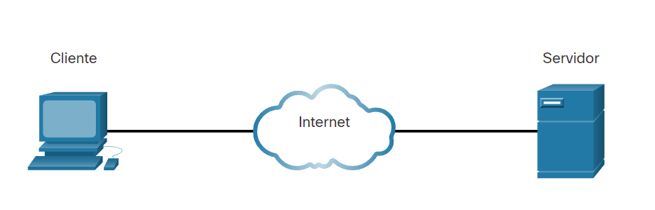
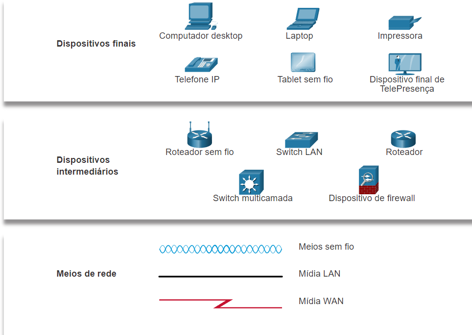
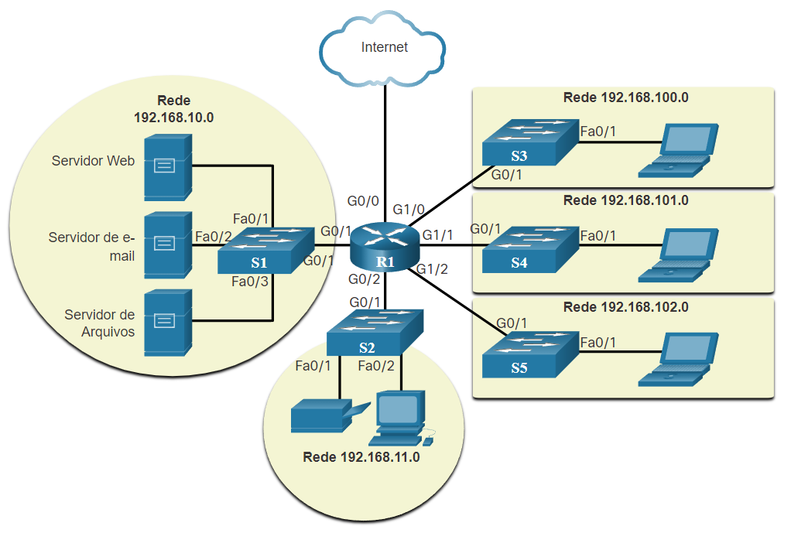
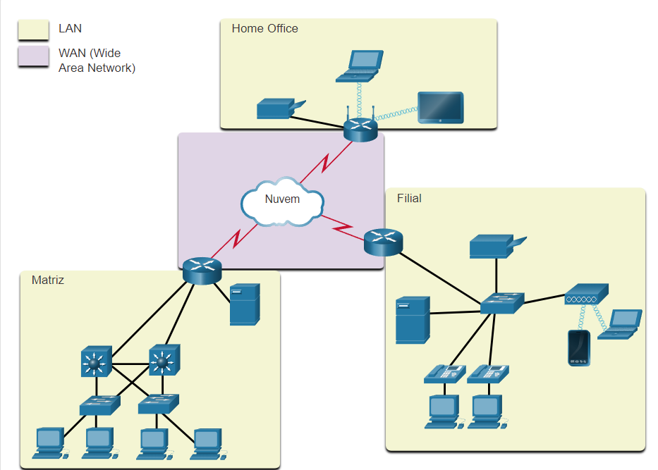
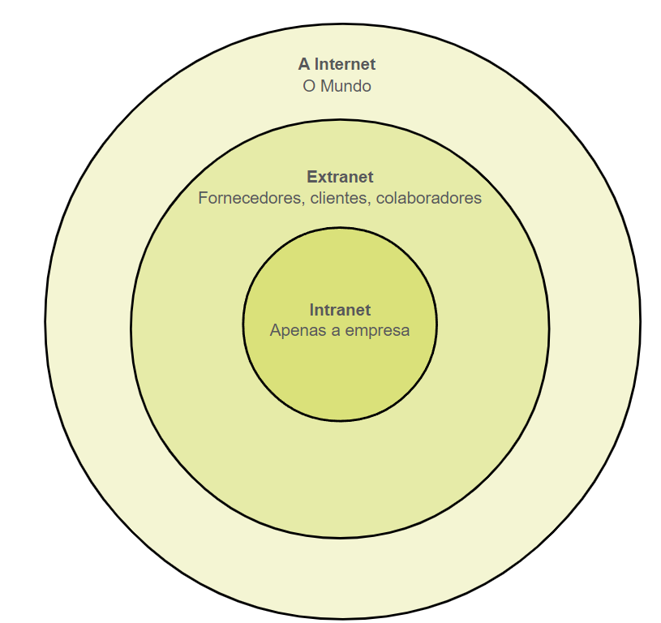

# Componentes de Rede

Todos os computadores que estão conectados a uma rede são classificados como **hosts**. Eles podem ser chamados como dispositivos finais ou clientes.

Host pode se referir especificamente a dispositivo de rede que recebe um número para fim de comunicação. Este número identifica o host dentro de uma rede específica. Ese número é chamado de IP (Internet Protocol).

Um endereço IP identifica o host e a rede à qual o host está conectado.

Servidores são computadores com software que lhes permite fornecer informações para outros dispositivos finais da rede.

Os clientes tem software para solicitar e exibir informações obtidas de um servidor - como um navegador, por exemplo.

Redes em que o computador funciona como servidor e cliente ao mesmo tempo é chamado de **Ponto a Ponto**.

Pontos acerca da REDE PONTO A PONTO

 - Fácil configuração
 - Menor custo
 - Menos complexo
 - Pode ser usado para tarefas simples.
 - Afeta desempenho
 - Não é seguro

## Dispotivos finais

Para distinguir cada dispositvo final - cada um possui um endereço. Quando um dispositivo inicia a comunicação, ele usa o endereço do dispositivo final para especificar onde entregar a mensagem.

## Dispositivos Intermediarios

Dispositivos intermediarios conectam dispositivos finais a rede. Eles podem conectar várias redes individuais para formuar uma internetwork. Asseguram que os dados fluam pela rede.

- Roteador 
- Switch
- Dispositivo de firewall

Eles podem executar:

- Regenerar e retransmitir sinais de comunicação;
- Manter informação sobre quais caminhos existem na rede;
- Notificar outros dispositivos de falhas e erros;
- Direcionar dados por caminhos alternativos quando houver falha;
- Classificar e direcionar mensagens com prioridade;
- Permitir ou negar o fluxo de dados.

## Meio de rede

É o meio que vai realizar a transmissão da comunicação:

- Fios de mtal de dados
- Fibra optica
- Transmissão sem fio

# Representação de Rede

Um diagrama fornece uma maneira fácil de entender como os dispositivos se conectam em uma rede grande. Ele é conhecido como **Diagrama de Topologia.**

> [!TIP]
Além das representações, é utilizada teminologia para descrever como cada um desses dispositivos se conectam:

- **Placa de Interface de Rede (NIC)**: Conecta fisicamente o dispositivo final da rede.
- **Porta fisica**: Um conector ou tomada em um dispositivo de rede onde a midia se conecta a um dispositivo final ou outro de rede.
- **Interface**: Portas especializadas em um dispositivo que se conectam a redes individuais. Exemplo, portas em um roteador.

## Diagramas de Topologia

Documentação obrigatoria pra quem trabalha com rede. Fornecem um mapa visual de como a rede está conectada.

### Diagrama Físico

Ilustra a localização física dos dispositivos intermediarios e a instalação dos cabos. Localização da sala e afins.

### Diagrama Lógico

Ilustram dispositivos, portas e o esquema de endereçamento de rede. Pode ver quais dispotivos estão conectados a quais dispositvos intermediarios.

## Tipos de Redes

- Rede domestica: Conectam alguns computadores entre si com a internet
- SOHO : Computadores se conectem a uma rede corporativa ou acesssem recursos compartilhados centralziados.
- Rede mundial: Rede de rede 0/

## LAN e WANs

**LAN** é uma infra de rede que fornece acesso a usuarios e dispositivos e muma pequena area geográfica. Ex: Departamento de uma empresa, em casa ou pequenas emrpesa.

- Administrada por uma organização ou pessoa.
- Fornece largura de banda de alta velocidade para dispositivos finais e intermediarios

**WAN** é uma infra que fornece acesso a outras redes em uma ampla área geográfica. São gerenciadas por provedores de serviço ou provedores de serviços de internet.

- Fornecem links de delocidade mais lenta que as LANS

> [!NOTE]
> As LANs utilizam serviços WANs para se interconectarem.

## Intranet e Extranet

Intranet é um termo para se referir a uma conexão privada de LANs e WANs que pertence a uma organização. É projetava para ser acessada apenas por membros de uma organização.

A organização pode usar uma **Extranet** para dar acesso a terceiros de modo seguro.

